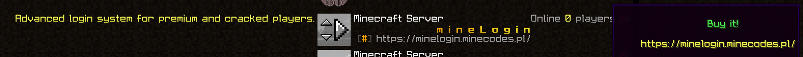

# 📶 Server ping & MOTD


 Allows you to set custom motd and server ping in minecraft main menu. You can also use hex colors using the `<#xxxxxx>` format or use a gradient by typing `<gradient:#xxxxxx:#yyyyy>`



 Pozwala ustawić customowe motd oraz server ping w głównym menu minecrafta. Możesz również użyć kolorów hex używając formatu `<#xxxxxx>` lub użyć gradientu wpisując `<gradient:#xxxxxx:#yyyyyy>`


```yaml
server-ping:
  #PL: Konfiguracja wiadomości motd.
  #EN: Configuring motd messages.
  message-of-the-day:
    #PL: Czy ta funkcja ma być włączona?
    #EN: Is this feature to be enabled?
    enabled: true
    #PL: Konfiguracja wiadomości.
    #EN: Messages configuration.
    messages:
    - '                    <gradient:#ffaf05:#fff023><bold>m i n e L o g i n</bold></gradient>{new}
      <dark_gray>[</dark_gray><gold>#</gold><dark_gray>]</dark_gray> <gray>Advanced
      login system.'
    - '                    <gradient:#ffaf05:#fff023><bold>m i n e L o g i n</bold></gradient>{new}
      <dark_gray>[</dark_gray><gold>#</gold><dark_gray>]</dark_gray> <gray>https://minelogin.minecodes.pl/'
  #PL: Konfiguracja niestandardowych wiadomośći po najechaniu na liste graczy online.
  #EN: Configure custom messages when hovering over a list of online players.
  players-info:
    #PL: Czy ta funkcja ma być włączona?
    #EN: Is this feature to be enabled?
    enabled: true
    #PL: Konfiguracja wiadomości.
    #EN: Messages configuration.
    messages:
    - ''
    - '                      <green>Buy it!'
    - ''
    - '      <yellow>https://minelogin.minecodes.pl/'
    - ''
  #PL: Niestandardwowa linijka tekstowa wzamian za ilość graczy online.
  #EN: Custom text line in exchange for number of online players.
  version-protocol:
    #PL: Czy ta funkcja ma być włączona?
    #EN: Is this feature to be enabled?
    enabled: true
    #PL: Protokół -1 umożliwia ustawienia niestandartowej linijki
    # tekstowej, pozostałe są pszypisane dla konkretnych wersji.
    #EN: Protocol -1 allows you to set a non-standard text
    # line, the others are assigned to specific versions.
    protocol: -1
    #PL: Konfiguracja wiadomości.
    #EN: Message configuration.
    #Placeholders: {online}, {slots}
    message: <yellow>Advanced login system for premium and cracked players.</yellow>                                                    <gray>Online</gray>
      <yellow>{online}</yellow> <gray>players
```


